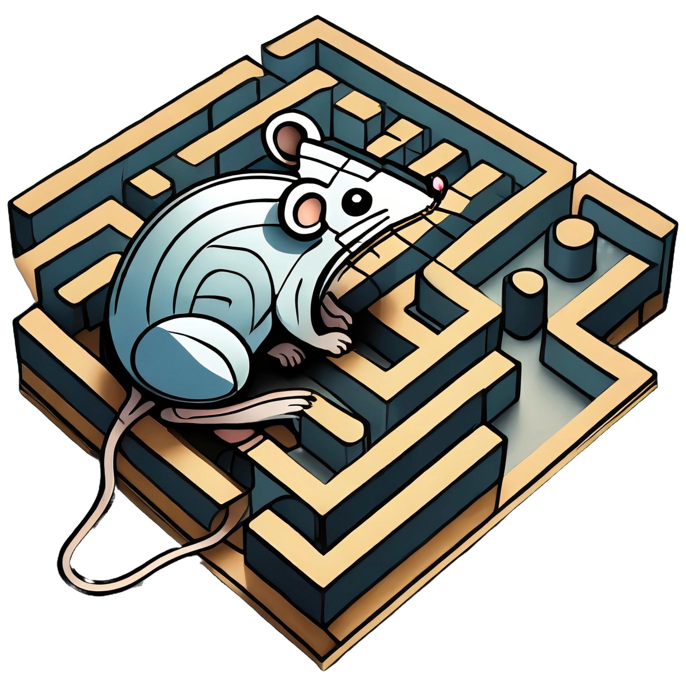
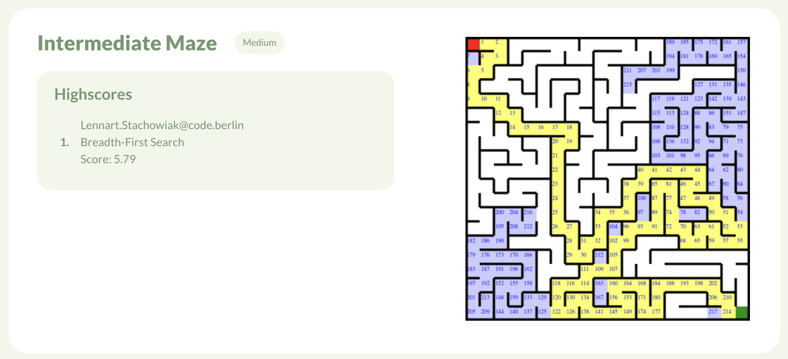
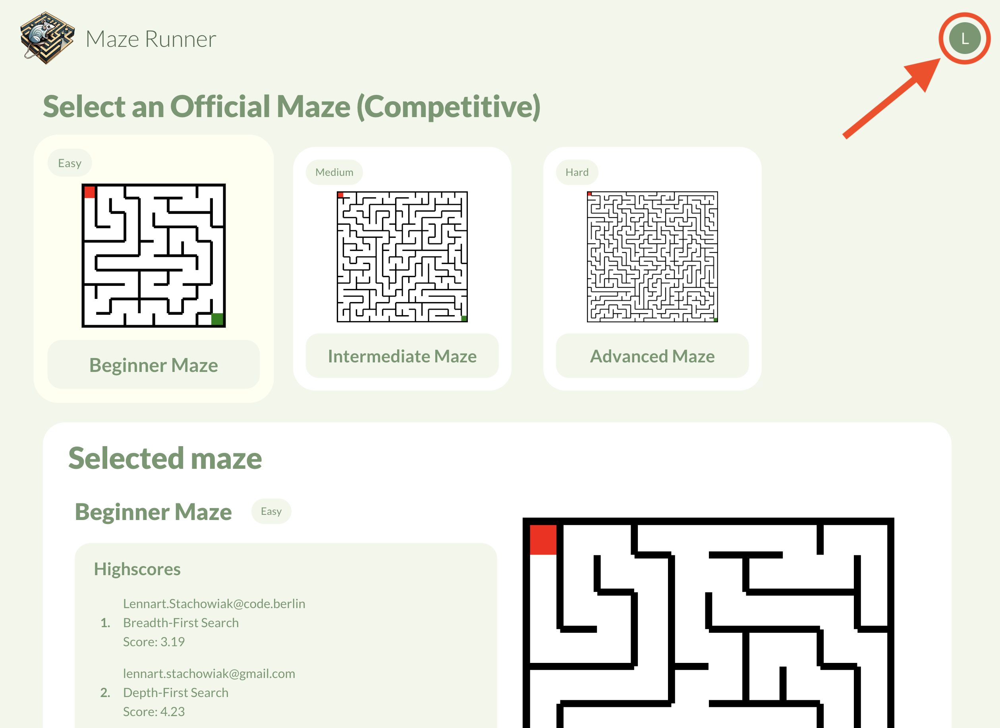
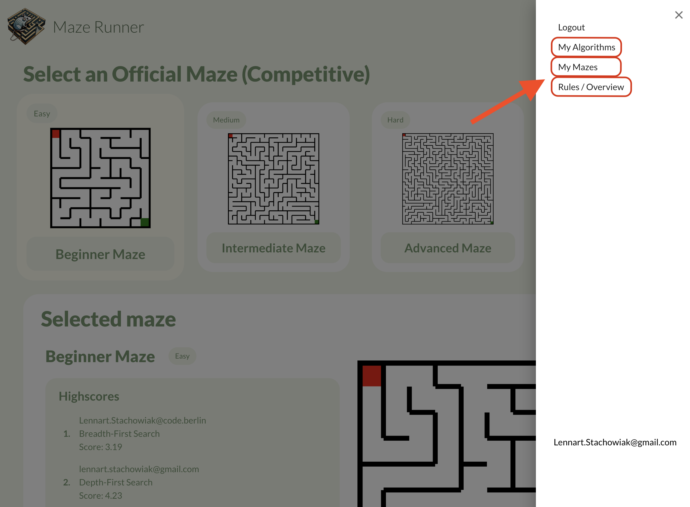
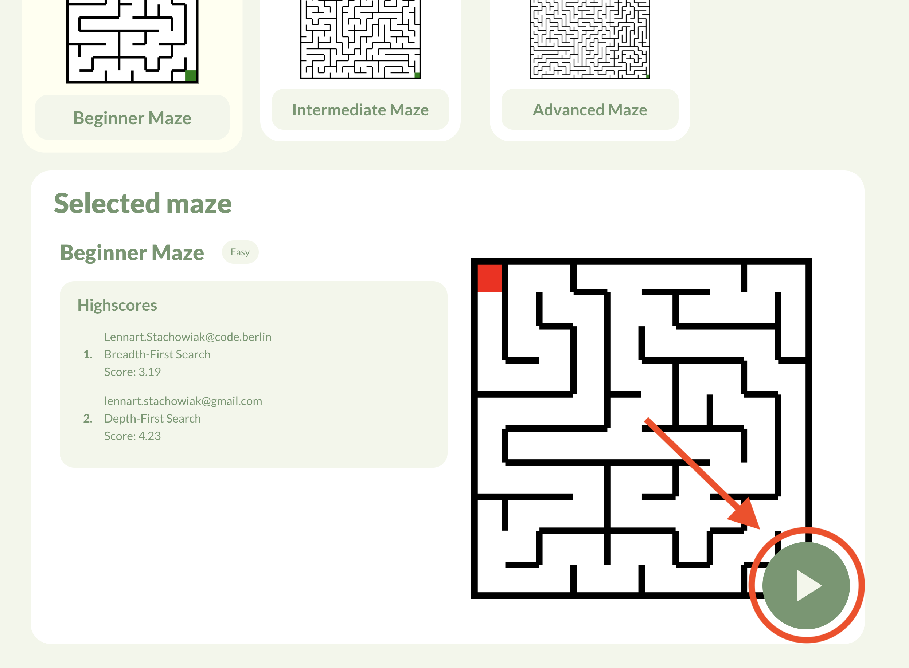
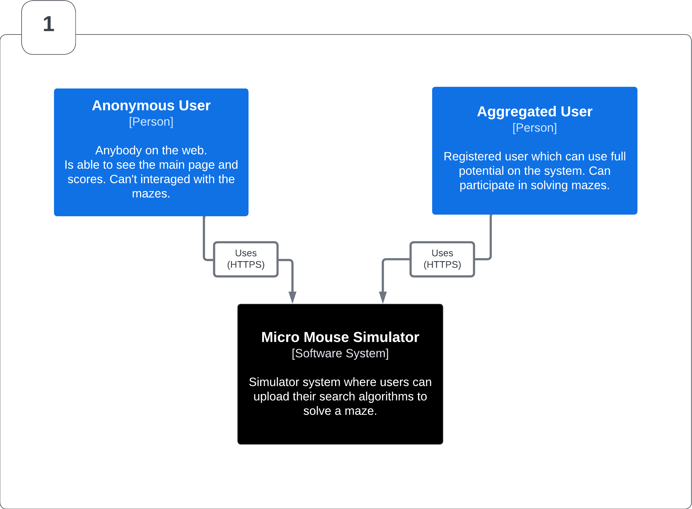
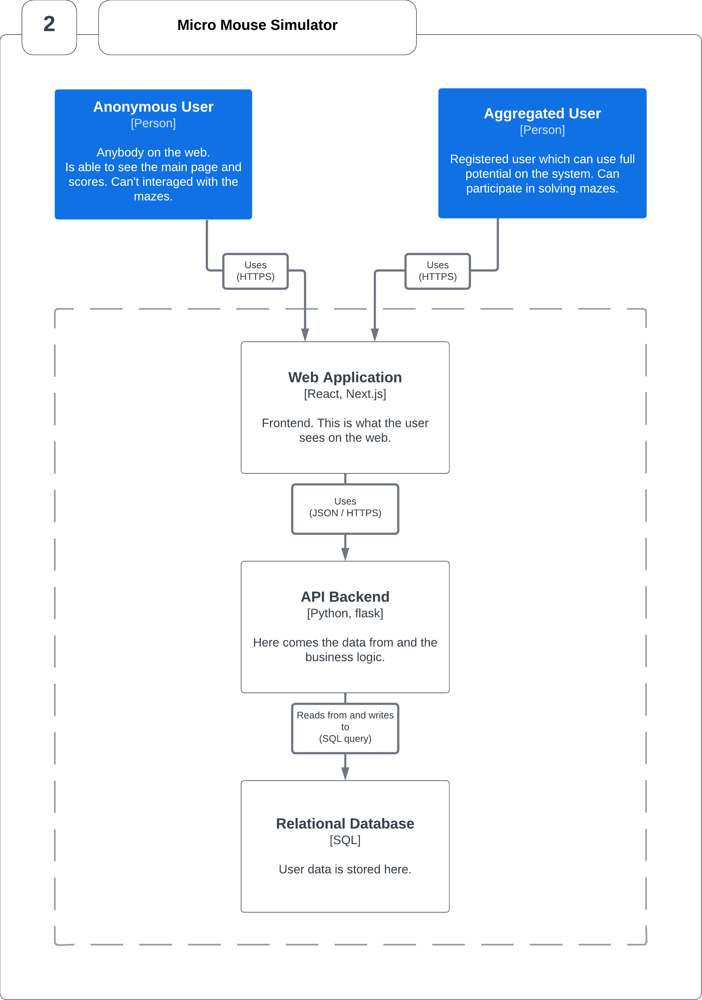
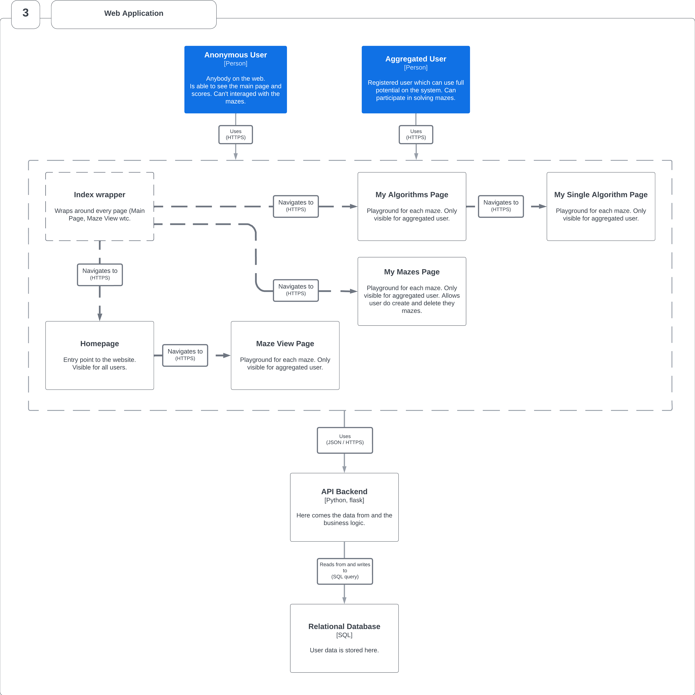

#  Maze Runner Website

#### Table of Contents

- [Documentation](#documentation)
  - [Overview](#overview)
    - [Website Navigation](#navigation)
  - [Project Structure](#structure)
  - [Design Patterns](#design)
  - [Styling](#styling)
  - [Routing](#routing)
  - [API Endpoints](#endpoints)
  - [External Dependencies](#dependencies)
  - [Diagrams](#diagrams)
- [Getting Started](#started)
  - [Running with Docker (recommended)](#docker)
    - [Prerequisites](#prerequisitesdocker)
    - [Installation](#installation)
    - [Setting up the environment](#envdocker)
    - [Running the application](#rundocker)
  - [Running with yarn or npm](#yarnnpm)
    - [Prerequisites](#prerequisitesyarnnpm)
    - [Installation](#installationyarnnpm)
    - [Running the application](#runyarnnpm)

---

# Documentation 

## Overview 

Here is the link to the hosted website of [Maze Runner](https://maze-runner-website.vercel.app/).

This is the website for [Maze Runner Backend](https://github.com/Lennartstachowiak/maze-runner-api).

- Maze Runner is a application on which users can compete against each other by creating algorithms to solve mazes.
- Each successful solution path from the start to the goal will be added to the highscore list.
- Users can generate new mazes which they own and can practice with.
- Algorithms can directly be created and edited in the application and can be tested while writing the code.
  - Errors will be shown as well.
  - Newly created Algorithm have to pass the test maze to be able to be used for other mazes.

To interact with the website you also need to run the backend.
On the website the user can interact with they algorithms and mazes. The user can edit algorithms and create new algorithms, can create new mazes, can solve mazes and compete against others in the highscore list.

### Website Navigation 

|                           How to open the navigation bar.                           |                                    Navigation bar                                     |
| :---------------------------------------------------------------------------------: | :-----------------------------------------------------------------------------------: |
|  |  |

**How to navigate to maze page**

 |

### Tech Stack

- The website is build with the frameworks [React](https://react.dev/), [Next.js](https://nextjs.org/) and [Typescript](https://www.typescriptlang.org/) as language. Styling is done with [MUI](https://mui.com/)

## Project Structure 

The application is handled with [Next.js](https://nextjs.org/).
The main entry file for the frontend application is the [`_app.tsx`](src/pages/_app.tsx) file which is a wrapper around all pages.

## Design Patterns 

### Atomic Design

I used the [Atomic Design](https://bradfrost.com/blog/post/atomic-web-design/) for the component structure.

## Styling 

Styling is done with [MUI](https://mui.com/) and the Theme provider of MUI in [`_app.tsx`](src/pages/_app.tsx). The styling of most of the colors and fonts is done in [theme.tsx](src/theme.tsx).

## Routing 

Routing is handled by [Next.js](https://nextjs.org/) and all routes are in the folder [pages](src/pages). For routing to a new page I used the [Next Router](https://nextjs.org/docs/pages/building-your-application/routing).

## API Endpoints 

The api endpoint to the packend are located in the [modules](src/modules) folder. Separated in authentication endpoints and other endpoints.

## External Dependencies 

Besides mentioned packages I also added:

- [SWR](https://swr.vercel.app/) for data fetching of [user data](src/modules/auth/api/AuthAPI.tsx) and [maze data](src/modules/API.tsx).
- [monaco-editor](https://microsoft.github.io/monaco-editor/) for the [code block component](src/common/components/organisms/Algorithm/AlgorithmCodeBlock.tsx) to edit the algorithm code.
- [husky](https://typicode.github.io/husky/) and [eslint](https://eslint.org/) for linting the code before [every commit](.husky/pre-commit).

### Diagrams 

|                  [Context Diagram](images/1_mms_overview.png)                  |                    [Container Diagram](images/2_application_overview.png)                    |
| :----------------------------------------------------------------------------: | :------------------------------------------------------------------------------------------: |
|  |  |

[**Pages Diagram**](images/3_backend_overview.png)

 |

---

# Getting Started 

You can run the programm locally in two different ways.

- Running with **Docker** (recommended)
- Running with **yarn** or **npm**

## Running with **Docker** (recommended) 

### Prerequisites 

- **Docker**
  - It is a platform that allows you to package, distribute, and run applications using containers.

### Tested versions

- **Docker** version 24.0.6, build ed223bc

  - Check with

        docker -v

- **Docker Compose** version v2.22.0-desktop.2

  - Check with:

        docker-compose -v

### Installation 

To use Docker with this project, you'll need to have Docker installed on your system. If you haven't installed Docker yet, follow these steps:

1.  Visit the Docker website: https://www.docker.com

2.  Download the installer for your operating system (e.g., Docker Desktop for Windows, Docker Desktop for macOS, Docker Engine for Linux).

3.  Run the installer and follow the on-screen instructions to complete the installation.

4.  Once the installation is complete, start the Docker application.

> 💡 For detailed installation instructions and system requirements, please refer to the official Docker documentation.

### Setting up the environment 

You need to create a `.env` file in the root directory and need to add some the endpoint for the backend:

    NEXT_PUBLIC_API_ENDPOINT=http://127.0.0.1:5000

### Running the application 

In root directory run:

    docker compose up

This command will set up everything for you automatically.

**Now you are ready to go!** 🚀

The website runs in the development mode.\
Open http://localhost:3000 to view it in the browser.

The page will reload if you make edits. You will also see any lint errors in the console.

---

## Running with **yarn** or **npm** 

### Prerequisites <a name="prerequisitesyarnnpm">

- `yarn` or `npm`

> 💡 `npm` and `yarn` are package managers used in JavaScript development to install and manage project dependencies efficiently from a central registry.

### Installation (Only one needed) 

- yarn
  - Check out the official website of [yarn](https://yarnpkg.com/) to install it for your operating system.
- npm
  - Check out the official website of [npm](https://www.npmjs.com/) to install it for your operating system.

#### Installing packages

##### Yarn

    yarn install

##### npm

    npm install

### Running the application 

##### Yarn

    yarn dev

##### npm

    npm run dev

**Now you are ready to go!** 🚀

The website runs in the development mode.\
Open http://localhost:3000 to view it in the browser.

The page will reload if you make edits. You will also see any lint errors in the console.
